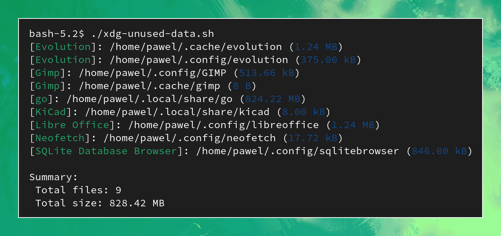

<h1 align="center">
   <br />
   XDG Unused Data
</h1>

A simple way to identify unused applications data in user directories such as ~./config and ~/.cache.

[](https://github.com/pawel-0/xdg-unused-data/actions/workflows/shellcheck.yml) &nbsp;
[](https://github.com/pawel-0/xdg-unused-data/actions/workflows/json_validation.yml)&nbsp;
[](https://github.com/pawel-0/xdg-unused-data/tree/main/applications)&nbsp;
[](https://github.com/pawel-0/xdg-unused-data/blob/main/LICENSE)

## Table of Contents

- [About](#about)
- [How it works](#how-it-works)
- [How to delete found files](#how-to-delete-found-files)
- [Dependencies](#dependencies)
- [Installation](#installation)
- [Arguments](#arguments)
- [Contribution](#contribution)

## About

A package manager (such as dpkg, rpm, apt, or dnf) generally does not remove application files from user directories. Over time, these folders might accumulate redundant files due to the installation and removal of various applications on the system, leading to clutter.

The goal of xdg-unused-data.sh is to identify this files and folders.



## How it works

The [`applications/`](https://github.com/pawel-0/xdg-unused-data/tree/main/applications) folder contains JSON files that provide information about each application, including its executable name and associated files and folders.

The scripts scans for each application. During execution, the script verifies the presence of both the executable and its corresponding files or folders. If the executable is missing but at least one of the associated files or folders exists, it is flagged for attention.

## How to delete found files

There is no built-in feature for deleting those files, as an earlier version had such functionality but was subsequently removed. The decision to eliminate this feature was made due to concerns about potential risks associated with modifying or removing user data.

If you wish to delete these files, you have a couple of options. One approach is to manually remove them using a file manager or terminal. However, a more elegant solution involves piping the script's output through `xargs` to `rm`.

The script detects when its output is being piped and automatically removes unnecessary information such as names, file sizes, and summary. Alternatively, you can achieve the same behavior by adding the `--raw` [argument](#arguments)`.

> :warning: **Data Loss Risk - Proceed with Caution**
> 
> Before executing any commands, please be aware that you are solely responsible for the consequences of running them. Deleting files using the following commands can lead to permanent data loss, and it is essential to exercise caution and understand what the commands mean before proceeding.

To delete all the files found by the script, you can run the following command:
```bash
./xdg-unused-data.sh | xargs rm -rf
```

If you only want to delete specific files, you can first filter the output using grep:
```bash
./xdg-unused-data.sh | grep gimp | xargs rm -rf
```

## Dependencies
The following requirements are needed to run xdg-unused-data
- [jq](https://github.com/jqlang/jq)


## Installation

__1. Clone repository:__

```sh
git clone https://github.com/pawel-0/xdg-unused-data
```

__2. Change directory__

```sh
cd xdg-unused-data/
```

__3. Set permission__

```sh
chmod +x ./xdg-unused-data.sh
```

__4. Run application__

```sh
./xdg-unused-data.sh
```

## Arguments
Usage: `xdg-unused-data.sh [argument]`

* `--help` Print help message
* `--raw` Print raw file pathes without colors and additional information to process them further


## Contribution
The projects success is all about how many applications it can support. And to achieve that excellent coverage, I could really use your help! If you happen to come across any files or folders in one of the xdg directories that aren't currently covered, I'd be thrilled if you could contribute to this project with a:

* **Ticket:** Please use [this issue template](https://github.com/pawel-0/xdg-unused-data/issues/new?assignees=&labels=&projects=&template=application-support.md&title=%5BSUPPORT%5D+Application+Name) to submit new applications. 
* **Pull request:** Please check the "[How it works](#how-it-works)" section and respect the [json schema](https://github.com/pawel-0/xdg-unused-data/blob/main/application_schema.json)

Thank you for supporting this project. You are highly appreciated.
